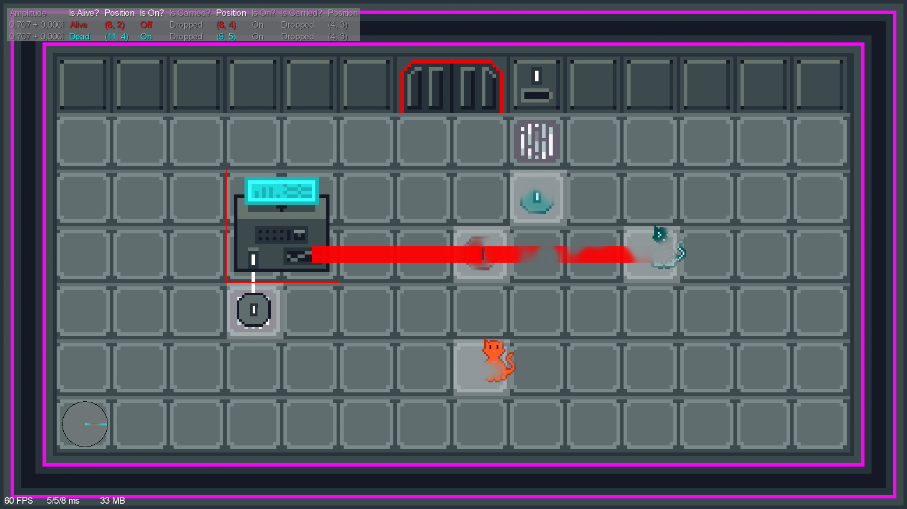

# Superposition

*Superposition* is a game about a cat in a box.

That cat is [Schrödinger's cat][schroedingers-cat], and the box is a world where quantum mechanical effects are as mundane as gravity.
In *Superposition*, Schrödinger's cat really can be both alive and dead at the same time.

At its core, *Superposition* is an interactive quantum simulator.
Every action you take as the player is a quantum operation.
Solving a puzzle is the same as building your own quantum circuit.

Head over to the [releases](https://github.com/samarsha/superposition/releases) page to download the demo, or check out these resources to learn more about *Superposition*:

* [A talk at *Women in Quantum Computing and Applications*][many-worlds-talk] featuring a live demo and deep dive into the game mechanics.
* [A blog post about the game][many-worlds-post], covering mostly the same topics as the talk but with a little more math and code.

[many-worlds-post]: https://www.sarahmarshall.name/blog/the-many-worlds-of-schroedingers-cat.html
[many-worlds-talk]: https://www.wiqca.dev/events/quantum101-quantum_games.html
[schroedingers-cat]: https://en.wikipedia.org/wiki/Schr%C3%B6dinger%27s_cat
